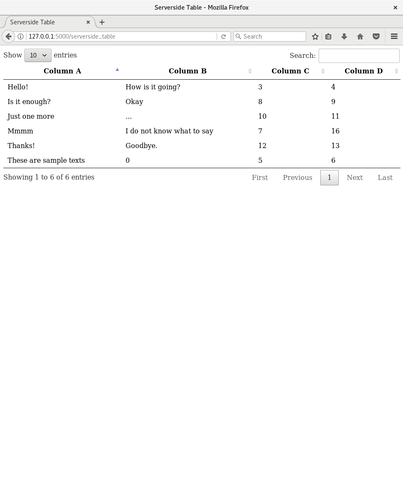

# datatables-flask-serverside

The main purpose of this repository is to create a reusable class (ServerSideTable) that manages the server-side data processing for DataTables in Flask back-ends.

Although it contains all the boilerplate to make the example runnable, the reusable part is the folder called [serverside](app/mod_tables/serverside) and it is composed by two files:
* [serverside_table.py](app/mod_tables/serverside/serverside_table.py):
    * It contains the **ServerSideTable** class. It is NOT necessary to touch it.
* [table_schemas.py](app/mod_tables/serverside/table_schemas.py):
    * It defines the schemas of the server-side tables we want to display.
    * Each schema is a list of Python dictionaries that represents each of the table's columns. The columns can be configured with the following fields:
        * **data_name**: Name of the field in the data source.
        * **column_name**: Name of the column in the table.
        * **default**: Value that will be displayed in case there's no data for the previous data_name.
        * **order**: Order of the column in the table.
        * **searchable**: Whether the column will be taken into account while searching a value.

## How to run the example?

In order to run this example, you just need to have flask installed and run the following command from the root of the repository:

`FLASK_APP=app/__init__.py flask run`

Then, go to [127.0.0.1:5000/](http://127.0.0.1:5000/) in any browser and you will be able to see both the client-side and the server-side tables:





## How to adapt the example to your own project?

Assuming that you already have a Flask app with DataTables and you want to add a server-side table, you have to follow these steps:
1. Include the [serverside](app/mod_tables/serverside) directory into your project.
2. Add the schema of your table in the [table_schemas.py](app/mod_tables/serverside/table_schemas.py), as it is done with *SERVERSIDE_TABLE_COLUMNS*.
3. In your Flask back-end, as it is done [here](app/mod_tables/models.py), create a **ServerSideTable** object by passing the following parameters to that constructor of the class:
  * The request object provided by Flask.
  * A list of dictionaries with the data that will fill the table (A dictionary per row).
  * The schema that was defined in the previous step.
4. In the HTML file, add a table tag, specifying the column names:

```HTML
  <table id="table_id">
    <thead>
      <tr>
        <th>Column A</th>
        <th>Column B</th>
        <th>Column C</th>
        <th>Column D</th>
      </tr>
    </thead>
  </table>
```

5. In the JS file, define the table with the **bProcessing** and **bServerSide** attributes as true. Don't forget to specify the endpoint that will process the data in your Flask back-end with the attribute **sAjaxSource** (e.g. */tables/serverside_table*).

```javascript
$(document).ready(function () {
  $('#table_id').DataTable({
    bProcessing: true,
    bServerSide: true,
    sPaginationType: "full_numbers",
    lengthMenu: [[10, 25, 50, 100], [10, 25, 50, 100]],
    bjQueryUI: true,
    sAjaxSource: '<API_ENDPOINT>',
    columns: [
      {"data": "Column A"},
      {"data": "Column B"},
      {"data": "Column C"},
      {"data": "Column D"}
    ]
  });
});
```
6. Enjoy your brand new table!
